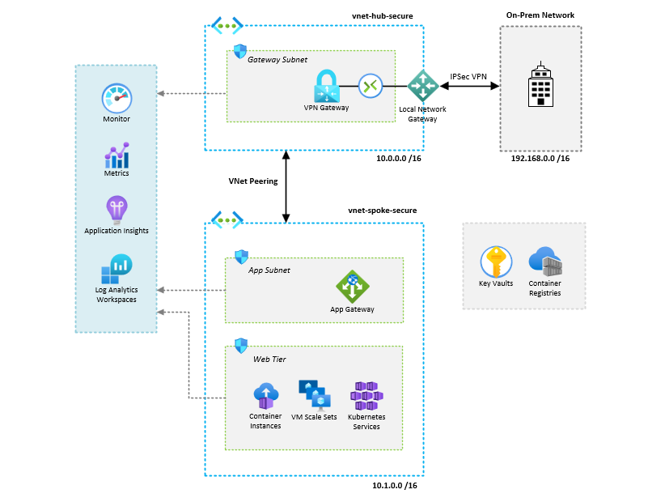

# Azure Enterprise Network Platform Architecture

This repository contains a production-style network architecture for deploying a secure, scalable architecture in Microsoft Azure. 

The focus of this project is not just infrastructure deployment, but network engineering architecture and best practices:

- Modular designm using Terraform modules
- Environment segmentation
- Reusability & Scalability
- Security Focused


---

## Project Goals

The goal of this project is to build a clean Terraform enterprise structure that communicates:

- My Proven ability to Build and Destroy complete environments with Terraform using Infrastructure as Code [IaC]
- Strong grasp of modular infrastructure design principles
- Srong experience with VPN Gateways, IPSec VPN connectivity and On-Premis connectivity.
- Clear understanding of Terraform environment separation and repository organization
- Security-first approach to cloud architecture, engineering solutions, not just deploying resources
- Strong experience with deploying Azure Container Instances and Azure Container Registry

---

## Architecture Overview

This infrastructure supports a hub and spoke architecture, IPsec VPN connectivity utilizing Azure VPN Gateways, Application Gateway, Azure Containers and Azure Key Vault.

Some of the Azure resources I will be deploying is as follows:

- Azure Virtual Network Gateway
- Azure Local Network Gateway
- IPSec VPN Connectivity
- Azure Key Vault
- Hub-and-Spoke topology [VNETs]
- Azure Application Gateway
- Netowrk Security Groups [NSGs]
- Virtual Network Peering
- Monitoring using Azure Log Analytics, Application Insights, Azure Monitoring, Metrics and Alerts.


---

## Enterprise Style Terraform Folder Structure

```text
enterprise-network-platform/
│   
├── modules/
│   ├── network/
│   │   ├── main.tf
│   │   ├── variables.tf
│   │   └── outputs.tc
│   │
│   ├── security/
│   │   ├── main.tf
│   │   ├── variables.tf
│   │   └── outputs.tf
│   │
│   └── vpngateway/
│       ├── main.tf
│       ├── variables.tf
│       └── outputs.tf
│
├── providers.tf
├── main.tf
├── README.md
└── variables.tf

```
---

## Design Principals

- Limit the use of hardcoded values
- Inputs defined via variables
- Outputs exposed for inter-module references
- No provider configuration inside modules
- Build modules to be reused without modification.

---


## Author

Mickal Speller<br>
Cloud & Network Engineering Portfolio Project<br>
Focused on engineering secure, scalable Azure architecture with Terraform best practices<br>
